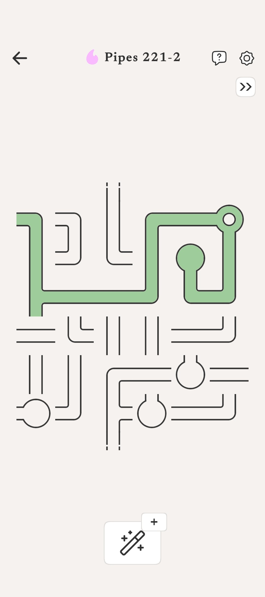
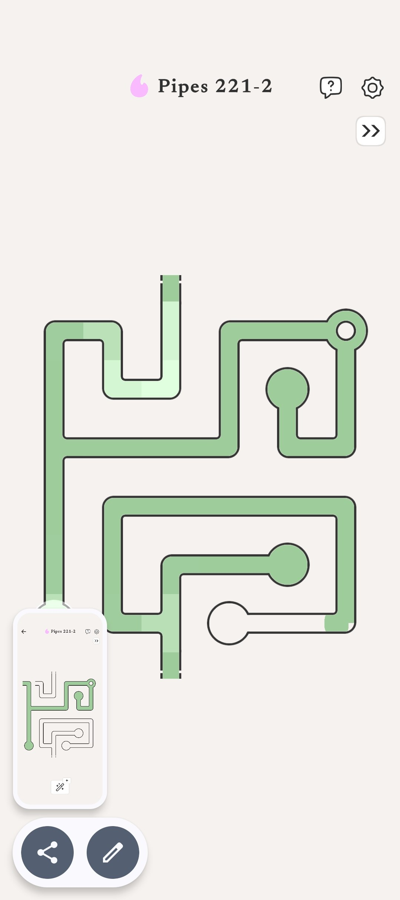
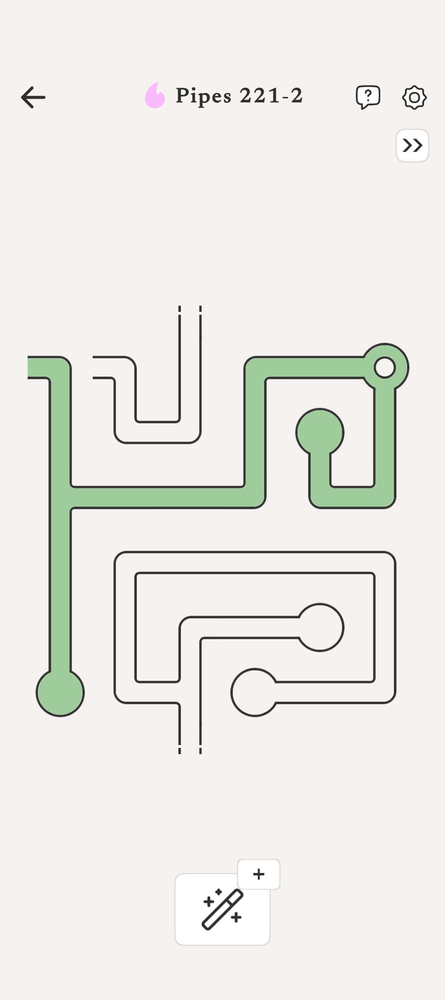
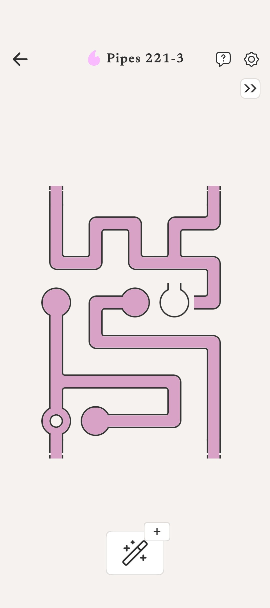

# FlowConnect (Pipe Puzzle Game)

## Problem Statement

Classic pipe-puzzle games like *Pipe Mania* (1989) and *Pipe Dream* provide satisfying spatial reasoning challenges, but most modern implementations are either ad-laden mobile clones with predatory monetization, or aging Flash-era browser games that no longer run. There is no clean, open-source, cross-platform pipe puzzle game that combines intuitive touch-first controls with progressive difficulty mechanics like bridges, tunnels, and teleportation portals — all running natively on Android, iOS, and the web from a single codebase.

## Goals

* **Cross-Platform Playability**: Run natively on Android, iOS, and modern web browsers from a single Flutter/Dart codebase with zero installs required for the web version.
* **Intuitive Touch-First Interaction**: Single tap (or click) rotates a tile 90° clockwise — no drag-and-drop, no complex gestures. Immediate pick-up-and-play experience.
* **Visual Flow Feedback**: Tiles connected to the Source fill with color in real-time, providing instant visual confirmation of progress. Completed paths illuminate with a victory animation.
* **Progressive Difficulty Curve**: Four difficulty tiers that incrementally introduce new tile types and mechanics, keeping the game accessible for casual players while offering depth for puzzle enthusiasts.
* **Advanced Puzzle Mechanics**: Beyond standard straight and corner tiles, include Bridge/Tunnel tiles (two paths crossing without connecting) and Portal/Teleport tiles (flow jumps to a distant grid position).

## Non-Goals

* **Multiplayer or Online Leaderboards**: The game is purely single-player and local. No server infrastructure or account system.
* **Monetization or Ads**: This is an open-source project, not a commercial product.
* **3D Rendering or Game Engines**: No Unity, Unreal, or Flame engine. Pure Flutter widgets and Canvas rendering are sufficient for a 2D tile puzzle.
* **Procedural Audio or Music**: Sound design is out of scope for the initial version.

## Technical Plan / Approach

### Architecture

A Flutter application structured with clean separation between game logic (pure Dart, no Flutter dependencies) and presentation (Flutter widgets/Canvas). This enables comprehensive unit testing of all puzzle mechanics without a Flutter test harness.

### Data Model

Each tile is represented as an object with:
- `type`: enum (`LINE`, `CORNER`, `T_JUNCTION`, `CROSS`, `SOURCE`, `SINK`, `BRIDGE`, `PORTAL`)
- `orientation`: integer (0, 90, 180, 270 degrees)
- `isFixed`: boolean (Source and Sink tiles cannot be rotated)
- `portalId`: optional string (links portal pairs)

The game grid is an `N × M` 2D array of tile objects. Grid dimensions scale with difficulty.

### Connection Verification

Victory is determined by a graph traversal (BFS or DFS) starting from the Source tile. At each step, the algorithm checks whether adjacent tiles have matching openings at their shared edge, accounting for current orientation. Bridge tiles require tracking two independent path layers. Portal tiles redirect traversal to the linked portal's grid position.

### Level Generation

Levels are generated by:
1. Placing Source and Sink on the grid
2. Building a valid solution path algorithmically (random walk with backtracking)
3. Filling remaining cells with random tiles
4. Scrambling all non-fixed tile orientations

### Rendering

Flutter's `CustomPainter` draws each tile on a Canvas. Tile artwork uses simple geometric shapes (arcs, lines, circles) for clean scalability across screen sizes. The color flow animation uses a fill overlay that propagates along verified connections.

## Alternatives Considered

* **Flame Engine**: Flutter's 2D game engine would provide a game loop, sprite system, and collision detection. However, FlowConnect is a turn-based tile puzzle — there are no physics, no continuous animation loops, and no sprite sheets needed. Standard Flutter widgets and `CustomPainter` are lighter and more maintainable for this use case.
* **React Native / Web-only**: A web-first approach (HTML5 Canvas + JS) would work for browsers but would require a separate effort for native mobile apps. Flutter provides genuinely native Android and iOS apps plus web support from one codebase.
* **Kotlin/Swift Native**: Building separate native apps would give the best per-platform performance but doubles (or triples) development effort for a puzzle game that doesn't need native GPU acceleration.

## Implementation Plan

### Phase 1: Core Engine & Data Model
* Define tile types, orientation logic, and grid data structure in pure Dart.
* Implement the BFS/DFS connection verification algorithm.
* Write comprehensive unit tests for connection logic with various grid configurations.

### Phase 2: Basic Tiles & Grid Rendering
* Build the Flutter UI: grid layout, tile rendering with `CustomPainter`.
* Implement tap-to-rotate interaction.
* Render Source and Sink as fixed, visually distinct tiles.
* Support `I` (line) and `L` (corner) tiles only.

### Phase 3: Flow Animation & Victory Detection
* Implement the color-fill animation propagating from Source along connected tiles.
* Add victory detection (flow reaches Sink) with a celebration animation.
* Build a simple level loader (hardcoded or JSON-based level definitions).

### Phase 4: Advanced Tiles
* Add `T` (T-junction) and `+` (cross) tiles.
* Implement Bridge/Tunnel tile logic (two independent paths on one cell).
* Implement Portal/Teleport tile logic (flow jumps across the grid).

### Phase 5: Level Generation & Progression
* Build the algorithmic level generator (valid solution → scramble).
* Implement the four difficulty tiers with appropriate grid sizes and tile sets.
* Add a level-select screen and progress tracking (local storage).

### Phase 6: Polish & Platform Release
* Responsive layout for phones, tablets, and desktop browsers.
* Hint system (reveal one correct tile orientation).
* Time attack and limited-moves modes.
* Android/iOS release builds, web deployment.

## Design Reference

Five concept mockups are available in the [design/](design/) directory:

## Open Questions

* **State Management**: Should we use Riverpod, BLoC, or simple `ChangeNotifier` for game state? (Riverpod is likely the best fit for a new Flutter project in 2026.)
* **Level Format**: JSON files vs. Dart-defined levels? JSON enables community level sharing; Dart keeps things simple and type-safe.
* **Bridge Rendering**: How to visually distinguish the "over" and "under" paths on a Bridge tile so players immediately understand the mechanic?
* **Accessibility**: Should tiles have distinct shapes (not just color) for colorblind players?
