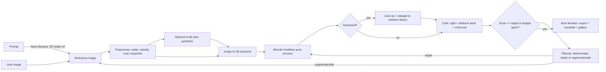

# Plastilina 🧱 — image/prompt → game-ready 3D, with a self-critiquing loop

> *Plastilina* is Italian for modelling clay: you give it a picture and it keeps
> reshaping the model until it looks right.
>
> This repo hosts only the spec. The implementation lives in a separate git
> repository: **`palladius/image2model3d`** (to be created).

## Problem Statement

Image-to-3D services (Tripo3D, Meshy, Rodin, open models such as TRELLIS or
Hunyuan3D) can turn one picture into a textured mesh in seconds. The output is
often **plausible but wrong**: feet too small, a flat nose, a face that doesn't
match, a back side that's made up, the wrong scale or orientation, broken
normals, and topology that falls apart as soon as you rig and animate it.
Today a human has to find these problems by eye in Blender and fix them by
hand, or re-roll and hope for a better result.

Plastilina wraps image-to-3D generation in a **closed generate → test →
critique → repair loop**. It tests the model both as a **rigid object** and,
for humanoids, **bound to one or more skeletons in a set of poses**. It turns
every problem into a **structured, machine-readable critique** ("feet 30% too
short vs source; nose depth flat from 90° view; elbow collapses at 120°
bend"). The critique either drives a **deterministic fix** (a Blender
operation) or is passed to an **LLM planner** that decides how to iterate
(edit the reference image, add views, regenerate, switch backend).
After a few minutes the user gets an auto-rotating model that exports cleanly
to Blender, Godot and other engines, saved in a gallery.

**Direct ancestor:** [`portr8`](../portr8/SPECS.md) does the same
generate → judge → refine loop for 2D portraits. Plastilina reuses its ideas
(JSONL ledger, best-so-far tracking, judge calibration, edit-vs-regenerate
strategy) and applies them in 3D.

## Goals

1. **Image → 3D**: accept a photo or a generated (Nano Banana) image and
   produce a textured 3D model plus a turntable viewer to rotate it.
2. **Prompt → image → 3D**: given only a text prompt, generate a
   **"3D-ready" reference image** first (full body, neutral A/T-pose for
   characters, plain background, even lighting, no crop), optionally a
   front/side/back **multi-view sheet**, then continue as in (1).
3. **Engine-ready output**: glTF 2.0 (`.glb`) as the primary format, plus FBX
   and `.blend`. Real-world scale (metres), clean origin, consistent axes, PBR
   textures, triangle budget presets and optional LODs. It must import without
   warnings in **Blender** and **Godot 4**, and work in Three.js, Unity
   (glTFast) and Unreal (glTF importer).
4. **Rigging for humanoids**: auto-rig onto a canonical humanoid skeleton and
   **retarget/test against a skeleton library** (Mixamo-style, Godot
   `SkeletonProfileHumanoid`, VRM 1.0, Rigify, Unreal-style bone naming). The
   result is a **compatibility matrix** showing which skeletons work and how
   well.
5. **Sophisticated feedback loop** (the core of the product):
   - **Rigid tests**: geometry/technical checks plus visual fidelity against the
     source image from multiple viewpoints.
   - **Skeleton tests**: a battery of poses/animations per skeleton, measuring
     deformation quality.
   - Every finding is emitted as a **structured critique** (JSON + Markdown +
     contact-sheet images) that is directly usable by an LLM.
   - Findings are repaired **deterministically** where possible and **via
     LLM-planned regeneration/edits** otherwise, within a time/cost budget.
6. **UI**: a web app with a live "Forge" view of the iterations, an **editor**
   for manual nudges and natural-language critique, an **auto-rotating viewer**
   for the result, and a **gallery** of saved projects.
7. **Headless & agent-friendly**: everything available through a CLI and an
   **MCP server**, so other agents (Gemini CLI, Antigravity, …) can call
   `forge`, `critique` and `export`.

## Non-Goals

- Training a new 3D generative model. Plastilina orchestrates existing ones.
- Replacing Blender as a sculpting/modelling tool. Heavy edits round-trip to
  Blender (see *Editor*).
- Animation authoring. Plastilina only *tests* with existing poses/clips.
- Hand-quality topology for AAA hero assets. The target is "good indie/prototype
  game asset" quality.
- Non-humanoid rigs (quadrupeds, vehicles with wheels) in v1. The schema
  must allow them later.
- Implementing anything inside this specs repo.

## Glossary

| Term | Meaning |
|---|---|
| **Project** | One subject (source image/prompt) and all of its iterations. |
| **Iteration** | One full generate → post-process → test → critique cycle, producing a candidate model. |
| **Critic** | The test-and-judge subsystem (deterministic checks + VLM eval). |
| **Critique** | Structured output of the Critic for one iteration (`critique.json`). |
| **Planner** | LLM that reads the critique and history and chooses the next action(s). |
| **Repair** | A deterministic Blender operation that fixes a known issue class. |
| **Canonical skeleton** | The internal humanoid bone set (VRM 1.0 humanoid bone names). All library skeletons map onto it. |
| **Pose battery** | The fixed set of poses/clips used to stress-test a rig. |

## Pipeline Overview



### Stages

1. **Input**
   - Image upload (PNG/JPEG/WebP), or prompt. Optional extra views supplied by
     the user (side/back photos).
   - User-set options: *subject type* (auto / humanoid / creature / prop),
     *style profile* (realistic / stylised / chibi, which changes proportion
     rules), *target* (Godot / Unity / Unreal / Web / Blender-only), *triangle
     budget* preset, *skeletons to test*, *time & cost budget*.
2. **Prompt → reference** (Goal 2): Nano Banana with a fixed
   "3D-ready" prompt template (versioned in the repo). It can generate a
   turnaround sheet (front / ¾ / side / back) using the front image as the
   character-consistency reference.
3. **Preprocess**: background matting, subject classification (VLM),
   tight crop and padding, 2D keypoints (body pose + face landmarks) and a
   segmentation of body parts. These become the **ground truth** that the
   Critic compares renders against.
4. **Multi-view synthesis** (optional, chosen by the Planner): generate missing
   views to constrain the backend (e.g. when the back looks invented).
5. **Image-to-3D backend** behind a **pluggable adapter**
   (`generate(images, options) → mesh + textures + metadata`):
   - **Local/GPU (default, €0)**: **TRELLIS** (MIT), **Hunyuan3D-2**
     (licence note, see *Licensing*), **Stable Fast 3D / SPAR3D**.
   - Cloud (optional, paid, **disabled by default**): **Tripo3D**, **Meshy**,
     **Rodin (Hyper3D)**. Some offer rigging/part-editing endpoints, which are
     exposed as capabilities.
   - Each adapter declares capabilities (`multi_view_input`, `texture_pbr`,
     `quad_remesh`, `rigging`, `part_edit`, `seed`) and a cost model.
6. **Post-process** (deterministic, **Blender headless** via the `bpy`
   module):
   - Units in metres; **glTF convention: Y-up, subject faces +Z**; origin
     at the centre of the feet/base on the ground plane (min Y = 0).
   - Scale from subject type, or from user-provided height (default human
     1.75 m).
   - Merge by distance, recalculate normals, remove tiny floating islands, fill
     small holes, optional symmetrize (only when the source is symmetric).
   - Decimate/remesh to the budget; UV unwrap if needed; bake PBR
     (baseColor, normal, ORM) at 1k/2k/4k; optional LOD0–LOD2.
7. **Rigging** (humanoids only):
   - Auto-rig onto the **canonical skeleton** using the backend's rigging
     endpoint if available, otherwise an open-source auto-rigger (e.g.
     UniRig), with fallback to Rigify metarig fitted to detected joints plus
     Blender automatic (heat) weights.
   - **Retarget** to each selected library skeleton via its bone map.
8. **Critic** → **Planner** → loop (see next section).
9. **Export & publish**: `.glb`, `.fbx`, `.blend`, optional `.vrm` (humanoids)
   and `.usdz`; turntable MP4/GIF/WebP; poster PNG; `critique.md` of the final
   iteration; all saved to the gallery.

## The Feedback Loop (core)

### Critic: what gets tested

All checks produce **metrics** and some produce **issues**. Each check has a
stable ID, a version, and thresholds that depend on the style profile.

#### A. Rigid / technical (deterministic)

| ID | Check | Example issue |
|---|---|---|
| `geo.manifold` | non-manifold edges, open boundaries | "312 non-manifold edges around left ear" |
| `geo.normals` | flipped/inconsistent normals | "face normals flipped on back of head" |
| `geo.islands` | disconnected small components | "47 floating fragments < 0.5% volume" |
| `geo.self_intersect` | intersecting faces in rest pose | "fingers fused" |
| `geo.budget` | tris/verts/materials/texture size vs preset | "82k tris > 30k budget" |
| `geo.uv` | UV overlap/stretch, texel density | "UV islands overlap 18%" |
| `geo.scale_axes` | height in plausible range, up/forward axes, origin | "model is 0.02 m tall / faces −Z" |
| `geo.grounding` | lowest point at y=0, stands within support polygon | "centre of mass outside feet: would tip over" |
| `geo.symmetry` | bilateral symmetry score (if expected) | "left arm 12% longer than right" |

#### B. Fidelity to the source (deterministic metrics + VLM)

- **Matched-camera render**: estimate the source image's camera (focal length,
  elevation, azimuth) by fitting the silhouette, then render the model from that
  camera.
  - `fid.silhouette`: mask IoU and contour Chamfer distance vs the source mask.
  - `fid.appearance`: perceptual similarity (LPIPS, DINOv2 embedding cosine)
    for the full image and **per region** (head, torso, hands, feet), using the
    part segmentation.
  - `fid.identity` (real people / named characters): face-embedding
    similarity of the rendered face crop vs the source face.
- **Proportions** (humanoids), `fid.proportions`: run the same 2D pose
  estimator on the render and the source and compare limb/head/foot ratios,
  plus anthropometric ranges for the style profile. This is what catches
  *"feet are 30% too small"* deterministically.
- **Turntable eval**, `fid.views`: render 8 azimuths × 2 elevations (contact
  sheet). A **VLM judge** (Gemini Pro) scores each view for consistency with
  the source and for plausibility of the unseen sides. The judge **must cite
  the view ID** for every complaint.
- **Free-form VLM critique**, `fid.vlm`: the judge gets the source plus the
  contact sheet and returns issues in the critique schema (e.g. "nose is flat
  in side views 90°/270°", "face does not resemble source at all from the
  front").

#### C. Skeleton tests (humanoids, per library skeleton)

- **Pose battery** (versioned): T-pose, A-pose, arms up, squat, sit, lunge,
  punch, look left/right, walk and run cycles, plus extreme joint ranges
  (elbow/knee 140°, shoulder 170°, spine twist 45°). Clips come from a
  licence-clean library (see *Licensing*) and are retargeted per skeleton.
- Metrics per pose:
  - `rig.joint_fit`: joints inside the mesh volume and near the expected
    anatomical positions (from 2D keypoints lifted to 3D).
  - `rig.weights`: unweighted vertices, >4 influences, **weight bleed** (e.g.
    hand vertices driven by the thigh), non-normalised weights.
  - `rig.deform`: volume loss at joints (candy-wrapper), edge-length
    distortion, collapsing elbows/knees.
  - `rig.collision`: self-intersection under pose (arm through torso, legs
    fused), ground penetration, foot sliding in walk/run.
  - `rig.vlm`: pose contact sheet judged by the VLM ("in squat, knees
    invert").
- Output: a **skeleton compatibility matrix** (skeleton × pose → pass/warn/fail
  + score).

#### D. Engine-readiness (deterministic)

- `eng.gltf_validator`: Khronos glTF-Validator gives 0 errors.
- `eng.blender_roundtrip`: re-import into a clean Blender, compare bounds,
  bone count, materials.
- `eng.godot_import`: a headless Godot 4 test project imports the `.glb`,
  checks `Skeleton3D` + humanoid `BoneMap` retarget, plays one clip, and
  reports import warnings. Screenshots are optional (needs a virtual display).

### Critique schema (LLM-feedable)

Each iteration writes `critique.json` (authoritative), `critique.md`
(human/LLM-readable summary) and `views/*.png` (contact sheets referenced by
ID). Shape:

```json
{
  "schema": "plastilina.critique/v1",
  "project_id": "p_7f3a",
  "iteration": 3,
  "scores": {
    "overall": 71, "fidelity": 64, "geometry": 88,
    "texture": 75, "rig": 69, "engine": 100
  },
  "issues": [
    {
      "id": "iss_012",
      "check": "fid.proportions",
      "region": "feet",
      "severity": "major",
      "category": "proportion",
      "message": "Feet are ~30% shorter than in source (foot/height 0.105 vs 0.150).",
      "evidence": { "metric": 0.70, "views": ["az000_el00", "az090_el00"] },
      "suggested_fixes": [
        { "kind": "deterministic", "repair": "scale_region",
          "params": { "region": "feet", "factor": 1.4, "falloff_m": 0.05 } },
        { "kind": "regenerate", "hint": "emphasise visible full-size shoes in reference" }
      ]
    },
    {
      "id": "iss_013",
      "check": "fid.vlm",
      "region": "nose",
      "severity": "major",
      "category": "shape",
      "message": "Nose is flat in profile views; source shows a pronounced aquiline nose.",
      "evidence": { "views": ["az090_el00", "az270_el00"] },
      "suggested_fixes": [
        { "kind": "edit_image", "hint": "add side-view reference showing nose profile" }
      ]
    }
  ],
  "skeleton_matrix": { "vrm": { "squat": "fail", "walk": "pass" } },
  "budget": { "elapsed_s": 212, "cost_eur": 0.0, "iterations_left": 3 }
}
```

Severities: `blocker` (asset unusable, e.g. not manifold for the engine), `major`,
`minor`, `cosmetic`. Categories: `proportion`, `shape`, `identity`,
`texture`, `geometry`, `rig`, `engine`.

### Repairs (deterministic, no LLM)

Each repair is a pure, parameterised, idempotent Blender script with unit
tests. Initial catalogue:

- `normalize_transform` (scale/axes/origin/grounding)
- `fix_normals`, `merge_by_distance`, `remove_islands`, `fill_holes`
- `decimate_to_budget`, `remesh_voxel`, `generate_lods`
- `symmetrize(axis, side)`
- `scale_region(region, factor, falloff)`: region from part segmentation
  projected onto the mesh, using soft-falloff vertex scaling and the
  corresponding bone scaling if rigged
- `smooth_region(region, iterations)` (e.g. lumpy face)
- `rebind_weights(method=heat|envelope)`, `normalize_weights(max=4)`,
  `smooth_weights(region)`, `snap_joints_to_volume_centroid`
- `rebake_textures(resolution)`

### Planner (LLM)

- Input: latest `critique.json`, a compact history of previous
  iterations (scores and actions taken), the backend capability list, and the
  remaining budget.
- Output (structured, via tool-calling): an **ordered action list** chosen from
  a fixed catalogue: `repair(<name>, params)`, `edit_reference(prompt)` (Nano
  Banana edit), `add_view(az, prompt)`, `regenerate(backend, seed, views)`,
  `switch_backend(name)`, `rerig(method)`, `accept`.
- Policy rules (enforced in code, not only in the prompt):
  - Prefer deterministic repairs for `geometry`/`engine`/`rig.weights` issues.
  - Never regenerate for issues that a repair can fix.
  - After two iterations with no score gain → change strategy (new views,
    different backend).
  - **Always keep best-so-far**. The final result is the best iteration,
    which is not necessarily the last one.
- **Anti-Goodhart safeguards**:
  - The judge and the planner use different prompts and roles, and can use
    different models.
  - Fidelity is measured on **all** views, so the planner can't over-fit the
    front view.
  - Some held-out views are never shown to the planner and are only used for
    the final score.

### Loop control

- Defaults: **max 6 iterations, 10 min wall clock, €0 cost** (local
  backends only; paid adapters refused unless explicitly enabled), target
  overall ≥ 80 with no `blocker`/`major` issue. All of these are configurable
  per project.
- Stop on: target reached, plateau (no gain > 2 points in 2 iterations), or
  budget exhausted.
- Every step is appended to `ledger.jsonl` (inputs, actions, metrics, cost,
  timing, model versions) so it is reproducible and can be audited.

### Human in the loop & judge calibration

- The user can add natural-language critique ("the nose is flat") at any time.
  It is parsed into schema issues and given priority.
- The user can **click on the model** to pin an issue to a region.
- For every judge issue, the user can give 👍/👎. Ratings are stored and used to
  report **judge/human agreement** per check, so thresholds and prompts can
  be tuned over time (same idea as portr8's calibration mode).

## UI

Web app, served locally (desktop browser first).

1. **New project**: drop an image or type a prompt; choose type, style
   profile, target engine, budget preset, skeletons and time/cost budget.
   One big "Forge 🔥" button.
2. **Forge (live)**: an iteration timeline. Each card shows a small turntable,
   the scorecard, the top issues and the actions taken. There's a diff view
   between two iterations (side-by-side turntables plus score deltas).
   Progress streams from the server (SSE). The user can stop, accept or branch
   at any time.
3. **Viewer**: auto-rotating turntable (default on), orbit/zoom, environment
   lighting presets.
   - Toggles: wireframe, normals, UV checker, weight paint, skeleton.
   - **Pose playback** per library skeleton/clip.
   - **Source overlay**: source image vs matched-camera render with silhouette
     overlay and a slider.
4. **Editor**:
   - Issue list (accept/dismiss/re-prioritise) and a free-text critique box.
   - Region pinning by clicking on the model.
   - Sliders for deterministic repairs (scale region, smooth, decimate,
     symmetrize) with live preview.
   - "Re-run Critic" and "Continue forging (N more iterations)" buttons.
   - **Blender round-trip**: "Open in Blender" exports a `.blend`. Saving it
     triggers re-import and re-critique.
5. **Gallery**: a grid of auto-rotating thumbnails (animated WebP), tags,
   search and filters (type, style, score, skeleton compatibility), a download
   menu for each format, and a provenance panel (source, prompts, backends,
   ledger). Projects can be deleted, duplicated or branched.

## Technical Plan / Approach

- **Language/runtime**: Python 3.11 (needed by the `bpy` wheel), managed
  with **`uv`**. A `justfile` holds the tasks (`just` → list first).
- **Backend**: FastAPI app plus a **job worker** (a simple SQLite-backed queue in
  v1). Long-running stages run as jobs. Progress is sent to the UI via SSE.
- **3D processing**: `bpy` (Blender as a Python module) for all repairs,
  rigging fallback, baking and rendering (Eevee for turntables, Workbench for
  fast masks). `trimesh` for quick metrics.
- **Vision**: background matting (rembg/SAM-class model), 2D pose and face
  landmarks (MediaPipe/DWPose-class), part segmentation, LPIPS/DINOv2
  embeddings, face embeddings for identity.
- **LLM/VLM**: Gemini via the `google-genai` SDK. Model names come from config
  aliases (e.g. `gemini-pro-latest` for judge/planner, Nano Banana for
  image generation/editing) so they don't go stale. All structured outputs use
  `responseSchema`.
- **Frontend**: server-rendered HTML + HTMX for the app shell, plus
  **Three.js** (vendored ES modules, no CDN) for viewer/editor. Use
  `<model-viewer>` for gallery thumbnails if it's lighter.
- **Storage**: local filesystem plus SQLite.
  `data/projects/<id>/{source/, iterations/<n>/{model.glb, critique.json,
  critique.md, views/, poses/}, export/, ledger.jsonl}`. Optional GCS sync
  later.
- **Interfaces**:
  - CLI `plastilina`: `forge --image|--prompt … [--target godot]
    [--skeleton vrm,godot] [--budget 10m]`, `critique <model.glb>
    --source ` (standalone, so it works on models from *any* tool),
    `repair`, `export`, `gallery`.
  - **MCP server** exposing `forge`, `critique`, `repair`, `export`.
- **Skeleton library**: `skeletons/<name>/` with `skeleton.glb` (rest pose),
  `bonemap.yaml` (→ canonical VRM humanoid names) and `meta.yaml` (licence,
  axis conventions). Ship only skeletons whose definitions can be
  redistributed. For engine-owned rigs (e.g. Unreal Mannequin), ship **only
  the bone-name map**, not the asset. **v1 set**: VRM 1.0 humanoid and Godot
  `SkeletonProfileHumanoid` (both free), plus a Mixamo bone-name map.
- **Compute (local-first)**: v1 runs entirely on the author's GPU
  workstation (*pupurabbu*) for a fast coding feedback loop. Local backends
  need an NVIDIA GPU (≥ 16–24 GB VRAM depending on model). The same container
  later moves to **Cloud Run + GPU** behind the same adapter interface.
- **Config**: `.env` (`GEMINI_API_KEY` or Vertex AI project, optional
  `TRIPO_API_KEY`, `MESHY_API_KEY`, …) documented in `.env.dist`.
  `plastilina.yaml` for budgets, thresholds and style profiles.

## Licensing, IP & Privacy

- **Backend output terms** differ: Tripo/Meshy/Rodin have plan-dependent
  ownership and commercial terms, so the adapter metadata records the
  provider and plan for each asset.
- **Hunyuan3D-2** community licence excludes the EU, UK and South Korea.
  The author is in Switzerland, so it is **allowed**. The adapter shows a
  warning for users in excluded territories. **TRELLIS** (MIT) is the
  licence-safe local alternative.
- **Animation clips**: only licence-clean sources (e.g. CMU mocap, own
  procedural poses). No Mixamo clips are redistributed. Mixamo is a
  *naming/compatibility* target only.
- **Real people**: photos of real people must be the user's own or used with
  consent. The gallery is private by default. There is no public sharing in
  v1.
- Every vendored dependency must use a permissive licence, listed in the
  implementation repo.

## Acceptance Criteria

1. `plastilina forge --image hero.png` runs fully on the local GPU at €0 and
   produces, within the default budget, a
   `.glb` that passes `eng.gltf_validator` with 0 errors and imports with no
   warnings in Blender 4.x and Godot 4.x (verified by the automated headless
   tests).
2. `plastilina forge --prompt "…"` generates a 3D-ready reference image and
   then a model, with no manual step.
3. Exported models are in metres, Y-up, face +Z, grounded at y=0, and within
   the selected triangle/texture budget.
4. For a humanoid, the model is rigged and tested against **both v1
   skeletons** (VRM 1.0, Godot humanoid), and the Mixamo-named export loads
   in Blender. The UI shows a skeleton × pose compatibility matrix,
   and the selected skeleton plays a walk clip in the viewer.
5. On a curated **regression set** (≥ 20 images: realistic people, stylised
   characters, props), the loop improves the overall score over iteration 1 in
   ≥ 70% of cases and never returns a result worse than iteration 1 (because it
   keeps best-so-far).
6. Seeded defects are detected: on a test set with known
   problems (feet scaled ×0.6, flattened nose, flipped normals, floating
   islands, weight bleed), each defect is reported with the right `check`,
   `region` and a matching suggested fix in ≥ 90% of cases.
7. `critique.json` validates against the published JSON Schema. Feeding it
   unchanged to an LLM (planner or external agent) gives actions from the
   catalogue only.
8. `plastilina critique <any.glb> --source ` works on models **not**
   produced by Plastilina.
9. The UI shows live iteration progress, a final auto-rotating model, the
   source overlay and an editor where a `scale_region` slider visibly changes
   the model. Accepted models appear in the gallery and can be downloaded in
   every export format.
10. Every iteration is reproducible from `ledger.jsonl`, apart from
    non-deterministic cloud backends, which are flagged as such.

## Alternatives Considered

- **Single-shot generation (no loop)**: what most tools do today.
  Rejected because the whole point is catching and fixing the "plausible but
  wrong" failures.
- **Paid cloud backends (Tripo/Meshy/Rodin) as default**: best quality with
  zero setup, but they break the €0 budget. They are kept as optional,
  disabled adapters.
- **VLM-only judging**: simple, but noisy and easy to game. Rejected in favour
  of **hybrid**: deterministic metrics where measurable (proportions,
  silhouette, topology, weights), and VLM for semantics (likeness, plausibility).
- **Pure in-browser pipeline (WebGPU)**: attractive for distribution, but
  Blender-grade repair, baking and rigging need `bpy`. Rejected for v1.
- **Rails/Ruby web front + Python workers**: nice for the app shell, but
  two runtimes double the ops overhead. Python-only is chosen for v1. It is
  easy to revisit because the UI talks to a plain JSON/SSE API.
- **Unity/Unreal as the test engine**: Godot is open-source, scriptable
  headless and a stated target. Unity/Unreal compatibility is covered by
  glTF/FBX validation only.

## Implementation Plan

1. **Skeleton walk**: CLI + one **local** backend adapter (TRELLIS or
   Hunyuan3D-2 on pupurabbu) + Blender
   headless `normalize_transform` + `.glb` export + turntable render + minimal
   Three.js viewer.
2. **Prompt path**: Nano Banana 3D-ready reference template and multi-view sheet.
3. **Critic v1**: technical checks (A), engine checks (D), silhouette IoU,
   contact sheets, VLM critique, then `critique.json` schema + `critique.md`.
4. **Loop v1**: repair catalogue (geometry + transform), planner with
   action catalogue, budget/plateau control, best-so-far, `ledger.jsonl`.
5. **Fidelity v2**: camera matching, pose-based proportions, per-region and
   identity similarity, `scale_region`/`smooth_region` repairs, seeded-defect
   test set.
6. **Rigging**: canonical skeleton, auto-rig + fallback, skeleton library with
   bone maps, pose battery, rig checks (C), compatibility matrix, Godot headless
   test.
7. **Web UI**: New / Forge (SSE) / Viewer / Editor / Gallery, Blender
   round-trip.
8. **MCP server**, more local backends (SF3D/SPAR3D), judge calibration
   (👍/👎 agreement report), regression benchmark in CI.
9. **Cloud Run + GPU** deployment of the same container, once 1–8 work locally.

## Decisions (2026-10-08)

- **Local-first, €0**: develop and run on the author's GPU workstation
  (*pupurabbu*). Move to Cloud Run + GPU only once it works locally.
- **v1 skeletons**: two free humanoids, **VRM 1.0** and **Godot
  `SkeletonProfileHumanoid`**, plus a Mixamo-compatible bone-name export.
- **Budget**: 10 min per project, **zero cost**. No paid third-party services.
- **Implementation repo**: `palladius/image2model3d`.

## Open Questions

- Which GPU and how much VRAM does pupurabbu have? This decides TRELLIS vs
  Hunyuan3D-2 (full vs mini) as the default, and whether texturing fits.
- How strict should likeness be for real people (identity score threshold),
  and is the face the priority over body/clothes?
- Should the gallery stay local only, or sync to a bucket / static site (with
  privacy implications for real people)?
